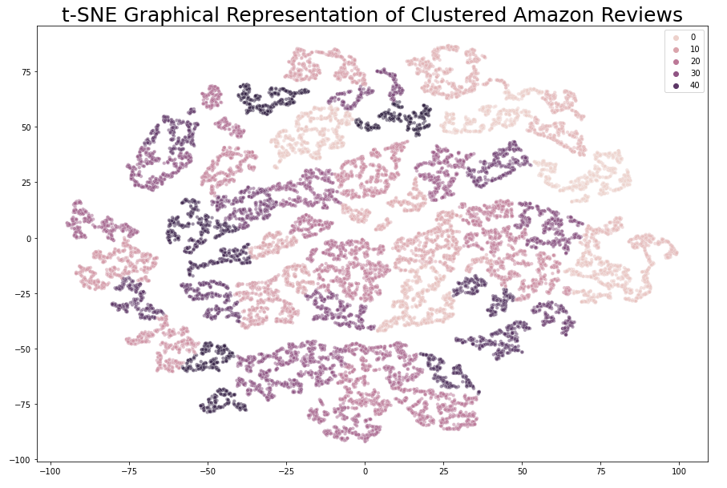

# Quick Tutorial of the Application of Doc2Vec on Amazon Reviews

## Objectives:
1. Utilize Doc2Vec as a means to summarize raw text data as a method of dim. reduction
2. Plot the data in a number of ways to visualize the document space
3. Cluster the documents through various methods

## Next Steps:
- Clean the text as a means of improving clustering
- Develop labels for the clusters through topic modelling
- Implement new clustering algorithms

